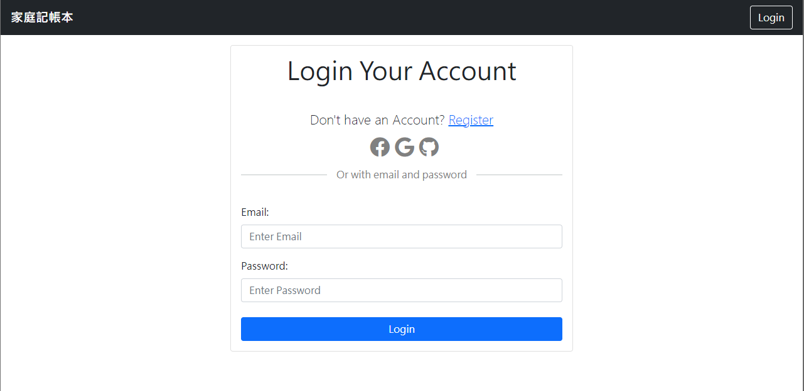
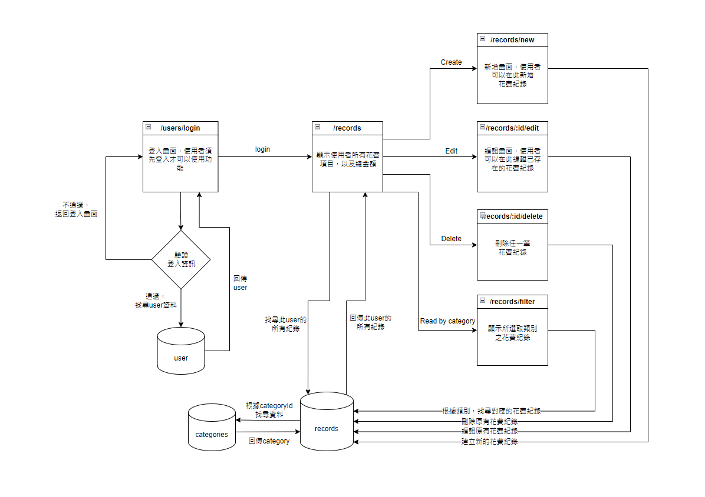
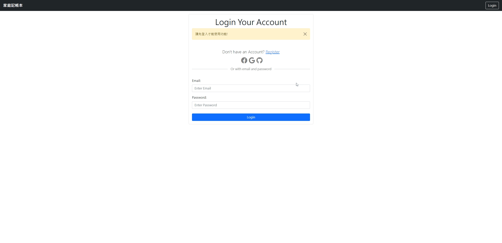
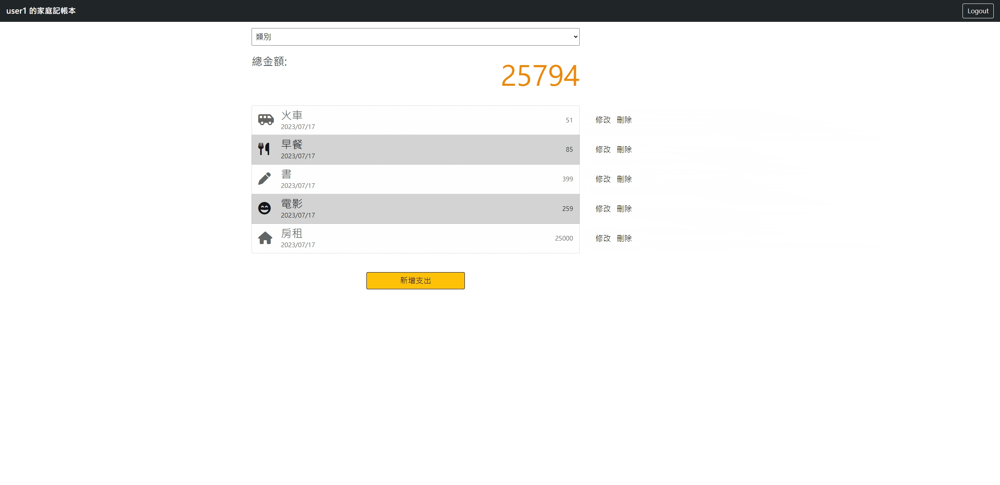

# Expense-Tracker 簡單生活記帳

## 目錄

- [Simple view - 產品畫面](#simple-view---產品畫面)
- [Feature - 產品功能](#feature---產品功能)
- [Installing - 安裝專案](#installing---安裝專案)
- [Program Logic - 程式邏輯](#program-logic---程式邏輯)
    - [主程式邏輯](#主程式邏輯)
    - [登入功能邏輯](#登入功能邏輯)
    - [RESTful 路由設計](#restful-路由設計)
- [Demo - 功能展示](#demo---功能展示)
- [Package - 使用套件](#package---使用套件)
- [Creator - 創作者](#creator---創作者)

## Simple view - 產品畫面

##### Home

##### Login

##### Register


## Feature - 產品功能

- 註冊
  - 使用者需要先註冊，才可以使用後續功能
  - 使用者填寫完資料後，會幫使用者驗證資料使否都符合填寫規則
- 登入
  - 使用者可以透過自己註冊的資訊登入
  - 使用者可以使用 Facebook 快速登入
- 登出
  - 使用者可以按下登出按鈕登出
- 基本功能
  - 使用者只會看到自己的記帳資料
  - 使用者可以新增花費紀錄
  - 使用者可以查看所有花費紀錄
  - 使用者可以查看指定類別的花費紀錄
  - 使用者可以修改任一筆花費紀錄
  - 使用者可以刪除任一筆花費紀錄

## Installing - 安裝專案

1. 請先確認有安裝 node.js 與 npm
2. 將專案 clone 至本地
3. 在本地開啟後，透過終端機進入資料夾，輸入 :

    ```bash
    npm install
    ```

4. 安裝完畢後，設定各項環境變數，以下有詳細說明
    - 專案內有預設`.envExample`, 將檔名中`Example`刪除後，即可開始設定
    - 打開後請更改以下項目
      ```bash
      MONGODB_URI = 'skip'
      FACEBOOK_ID = 'skip'
      FACEBOOK_SECRET = 'skip'
      ```
    - 詳細說明  
        - [MongoDB](#mongodb)
        - [Facebook](#facebook)
        - [Google](#google)
        - [Github](#github)

    #### MongoDB
      - 請先到[MongoDB](https://account.mongodb.com/account/login?_ga=2.95424735.215886225.1688086051-1089227879.1684278227)註冊
      - 註冊完畢並且登入後，根據以下圖片進行操作
      ##### 1.
      
      ##### 2.
      
      ##### 3.
      
      - 複製圖片3的連結後，將它貼到`MONGODB_URI`，並且輸入您自己的資料庫密碼(連結中`<password>`這邊更換成自己的密碼)

      ```bash
      MONGODB_URI = mongodb+srv://<Your MongoDB Account>:<Your MongoDB Password>@cluster0.xxxx.xxxx.net/<Your MongoDB Table><?retryWrites=true&w=majority
      ```

    #### Facebook
      - 請先到[Facebook developers](https://developers.facebook.com/?locale=zh_TW)登入或註冊，並完成相關前置作業。
      - 完成後將下圖的`應用程式編號`和`應用程式密鑰`填到對應的環境變數即可
   
      

      ```bash
      FACEBOOK_ID = 應用程式編號
      FACEBOOK_SECRET = 應用程式密鑰
      ```

    #### Google
      - 請先到[Google Cloud](https://cloud.google.com/?hl=zh-tw)登入或註冊，並完成相關前置作業。
      - 完成後將下圖的`用戶端編號`和`用戶端密鑰`填到對應的環境變數即可
   
      

      ```bash
      GOOGLE_ID = 用戶端編號
      GOOGLE_SECRET = 用戶端密鑰
      ```

    #### Github
      - 請先到[Github developer setting](https://github.com/settings/developers)完成相關前置作業。
      - 完成後將下圖的`Client ID`和`Client secrets`填到對應的環境變數即可
   
      

      ```bash
      FACEBOOK_ID = Client ID
      FACEBOOK_SECRET = Client secrets
      ```  

5. 設定完畢後，可以在終端機中輸入以下指令產生種子資料

    ```bash
    npm run seed
    ```

    ##### *預設有提供兩組使用者可以做測試
    | 使用者名稱 | email | 密碼 |
    | :---: | :---: | :---: |
    | user1 | user1@example.com | 123456789 |
    | user2 | user2@example.com | 123456789 |

6. 若在終端機中看見此行訊息則代表順利運行，打開瀏覽器進入下列網址

    ```bash
    App is running on http://localhost:3000
    ```

7. 若欲暫停使用

    ```bash
    ctrl + c
    ```

## Program Logic - 程式邏輯 

### 主程式邏輯



### 登入功能邏輯


### RESTful 路由設計

| Action | HTTP method | route |
| :--- | :--- | :--- |
| 首頁 | GET | /records |
| 顯示符合條件的花費紀錄 | GET | /records/filter |
| 新增記錄畫面 | GET | /records/new |
| 新增一筆紀錄 | POST | /records/new |
| 修改記錄畫面 | GET | /records/edit |
| 修改一筆紀錄 | PUT | /records/edit |
| 刪除一筆紀錄 | DELETE | /records/delete |
| 登入畫面 | GET | /users/login |
| 登入 | POST | /users/login |
| 註冊畫面 | GET | /users/register |
| 註冊 | POST | /users/register |
| 登出 | GET | /users/logout |
| 使用Facebook登入 | GET | /auth/facebook |
| Facebook回傳資料 | GET | /auth/facebook/callback |

## Demo - 功能展示

### 首頁
- 顯示所有花費紀錄
- 顯示指類別花費紀錄


### 新增


### 編輯


### 刪除


### 登入


### 註冊


### 登出


## Package - 使用套件

| Package | version |
| :--- | :--- |
| Node.js | v14.16.0 |
| express | v4.18.2 |
| mongoose | v7.3.0 |
| express-handlebars | v3.0.0 |
| just-handlebars-helpers | v1.0.19 |
| express-session | v1.17.1 |
| bcryptjs | v2.4.3 |
| connect-flash | v0.1.1 |
| passport | v0.4.1 |
| passport-facebook | v3.0.0 |
| passport-local | v1.0.0 |
| dotenv | v16.1.4 |
| body-parser | v1.20.2 |
| method-override | v3.0.0 |

## Creator - 創作者

### iamcoolAlan